# Why Did The AI Do That?

Welcome to the HKPUG AI Explainability Challenge.

This is the follow-up trail for the July explainability and observability
workshop idea:

- May data workshop: clean the data.
- July workshop: understand and debug what the model or AI app does next.

## The One-Minute Version

SHAP answers:

> Why did this model make this prediction?

Opik answers:

> What happened inside this LLM, RAG, or agent request?

That is the whole workshop.

If a fraud model says "high risk", SHAP helps you explain which features pushed
that score up or down. If a support bot gives a nonsense answer, Opik helps you
trace the request and find whether retrieval, the prompt, the tool call, or the
model response went wrong.

!!! tip "Plain-English promise"
    You do not need a PhD, Kaggle trophy, or LLM infrastructure budget. The
    first pass uses small JSON artifacts. You read them, explain them, and let
    GitHub Actions score your writeup.

## Trail Map

```mermaid
flowchart LR
  A["SHAP mental model"] --> B["Global feature importance"]
  B --> C["Local wrong prediction"]
  C --> D["Data leakage trap"]
  D --> E["Model incident note"]
  E --> F["Opik trace reading"]
  F --> G["Evaluation dataset"]
  G --> H["Before/after trace compare"]
  H --> I["Safe evidence boundary"]
  I --> J["Capstone incident report"]
```



## What You Will Build

You will submit mission files like:

```text
submissions/AIEX-YOUR-TEAM/mission-03.json
```

Each mission asks for a small answer and the evidence you used. GitHub Actions
then scores the submission.

This is a learning game, not a hacking contest. The score is there to keep the
feedback loop quick.

## Official References

- [SHAP documentation](https://shap.readthedocs.io/) describes SHAP as a
  game-theoretic way to explain machine-learning model output.
- [Opik documentation](https://www.comet.com/docs/opik) describes Opik as LLM
  observability and evaluation tooling for traces, datasets, metrics, and
  production monitoring.

## Start

1. Read [Rules](rules.md).
2. Read [How To Play](working-format.md).
3. Read [SHAP for Humans](shap-for-humans.md).
4. Read [Opik for Humans](opik-for-humans.md).
5. Start [Mission 01](labs/mission-01.md).
