# Why Did The AI Do That?

Welcome to the HKPUG AI Explainability Challenge.

This tutorial is written as a short textbook for the July follow-up workshop on
AI explainability and observability. The May data workshop taught people how to
clean data and build a better dataset. This trail starts at the next practical
question:

> After the model or AI app gives an answer, how do we understand what happened?

That question matters because a correct answer is not always enough. A model can
be accurate for the wrong reason. A chatbot can fail even when the language model
itself is powerful. A team can improve a system and still have no proof that the
change fixed the original failure. Explainability and observability give us the
habit of looking for evidence before making confident claims.

## Learning Objectives

By the end of this trail, you should be able to:

1. Explain the difference between model explainability and AI app observability.
2. Read a simple SHAP summary and identify which features matter most.
3. Explain one prediction by separating risk-up and risk-down feature effects.
4. Recognize a data leakage warning even when a SHAP chart looks impressive.
5. Read an Opik-style trace and identify which step caused a bad answer.
6. Turn a bad AI response into a repeatable evaluation case.
7. Complete a harder capstone that combines SHAP, Opik, safety, and actions.

The goal is not to memorize tool names. The goal is to learn a debugging habit:
make a claim, point to evidence, and describe what should change next.

## Two Questions, Two Tools

SHAP and Opik are both useful, but they are useful at different levels.

SHAP answers:

> Why did this model make this prediction?

Opik answers:

> What happened inside this LLM, RAG, or agent request?

Here is the difference in a concrete workshop story. Suppose a loan-risk model
marks an applicant as high risk. SHAP helps you explain which input features
pushed that prediction upward or downward. Now suppose an event support bot
answers a typhoon refund question with Wi-Fi instructions. Opik helps you trace
the request and find whether the retriever, prompt, tool call, model output, or
evaluation step failed.

The first problem is about a model output. The second problem is about an
application workflow.

!!! tip "Plain-English promise"
    You do not need a PhD, Kaggle trophy, or LLM infrastructure budget. The
    first pass uses small JSON artifacts. You read them, explain them, and let
    GitHub Actions score your writeup.

## How This Textbook Is Organized

The trail is split into two parts. The first part teaches concepts. The second
part asks you to use those concepts in small missions.

```mermaid
flowchart LR
  A["Chapter 1: SHAP mental model"] --> B["Global feature importance"]
  B --> C["Local prediction explanation"]
  C --> D["Data leakage warning"]
  D --> E["Model incident note"]
  E --> F["Chapter 2: Opik trace mental model"]
  F --> G["Trace failure diagnosis"]
  G --> H["Evaluation dataset"]
  H --> I["Before/after comparison"]
  I --> J["Capstone evidence synthesis"]
```



Each mission follows the same rhythm:

1. Read a small artifact.
2. Identify the relevant evidence.
3. Write a short explanation in JSON.
4. Let GitHub Actions give you quick feedback.

The score is not the real prize. The score is a feedback loop. If the action
says your answer is incomplete, it usually means your evidence is too vague or
you pointed at the wrong part of the artifact.

## Try The Interactive Labs

The challenge includes two embedded exercises you can use before submitting
mission answers:

- [SHAP force playground](interactive-labs.md#shap-force-playground): move
  feature controls and watch the prediction and contribution bars change.
- [Opik trace terminal](interactive-labs.md#opik-trace-terminal): run trace
  commands, inspect bad spans, compare before/after traces, and read evaluator
  gates.

These labs are not separate software. They are embedded directly inside the
tutorial HTML, so participants can use them from the browser while reading the
textbook.

## What You Will Submit

You will submit files like:

```text
submissions/AIEX-YOUR-TEAM/mission-03.json
```

Each mission file contains:

- your participant ID
- the mission ID
- a structured answer
- the evidence you used

The scoring workflow reads only JSON and Markdown under `submissions/`. It does
not execute participant code. This is deliberate: explainability work should
teach careful evidence handling, not unsafe execution of random pull-request
code.

## The Running Example

The tutorial uses two toy artifacts:

| Artifact | What it represents | Tool habit |
|---|---|---|
| `loan_risk_casebook.json` | A small model explanation export | Read SHAP-style feature contributions |
| `support_bot_traces.json` | A small AI support-bot trace export | Read Opik-style traces and evaluator scores |

These artifacts are intentionally small. A beginner should be able to open them
in a text editor and follow the logic. The real tools can produce richer charts,
dashboards, and traces, but the first learning step is understanding what the
evidence means.

## Official References

- [SHAP documentation](https://shap.readthedocs.io/) describes SHAP as a
  game-theoretic approach to explain machine-learning model output.
- [Opik documentation](https://www.comet.com/docs/opik) describes Opik as LLM
  observability and evaluation tooling for traces, datasets, metrics, and
  production monitoring.

## Start

1. Read [Rules](rules.md).
2. Read [How To Play](working-format.md).
3. Open [Interactive Labs](interactive-labs.md).
4. Read [SHAP for Humans](shap-for-humans.md).
5. Read [Opik for Humans](opik-for-humans.md).
6. Start [Mission 01](labs/mission-01.md).
