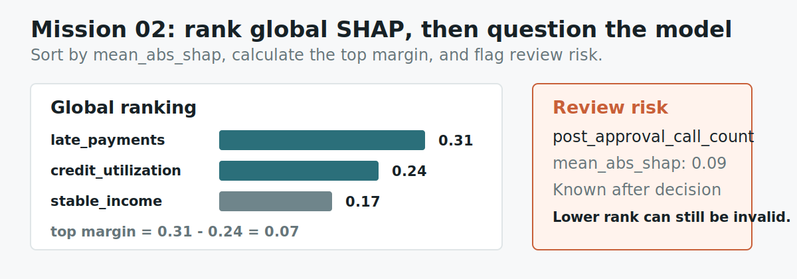

# Mission 02: Rank Global SHAP And Flag Review Risk

## Learning Objective

This mission teaches you to read global feature importance. The word "global"
means you are looking across many examples, not explaining just one row.

By the end of this mission, you should be able to open a SHAP-style summary and
identify which features usually move the model output the most.

{ .mission-infographic }

<div class="mission-widget" data-mission-widget="mission-02"></div>

## Artifact

```text
labs/artifacts/loan_risk_casebook.json
```

Open the `global_summary` section.

## Background

`mean_abs_shap` means average strength. The sign is ignored because this summary
only asks "how much does this feature usually move the score?"

The largest value is the top global feature. In this mission, you also need to
calculate the margin between the first and second features and flag the feature
that deserves a separate review.

This is different from a local explanation. A global summary is useful for
understanding the model's general behavior, but it does not explain every single
prediction. Treat it like a map of the model's usual habits.

## Mini Lesson

Global SHAP is often the first chart people look at during model review. It can
answer questions like:

- Which columns does the model usually care about?
- Are the important columns reasonable for this task?
- Is the model relying on a surprising shortcut?
- Which features should we inspect more carefully?

In this mission, the value `mean_abs_shap` is the important number. "Mean" means
average. "Abs" means absolute value, so negative signs are removed before
averaging. The result is a strength score. A feature with a larger
`mean_abs_shap` usually moves predictions more strongly than a feature with a
smaller value.

This does not tell you whether the feature usually pushes risk up or down. It
only tells you how much the feature tends to matter.

## Study Note

It helps to separate three ideas that beginners often mix together:

| Idea | Meaning |
|---|---|
| Importance | How strongly a feature tends to move predictions |
| Direction | Whether a feature pushes one prediction up or down |
| Quality | Whether using that feature is a good idea |

This mission is only about importance. The global summary can tell you that
`late_payments` is usually a strong driver. It does not, by itself, prove that
the model is fair, legal, causal, or correct. It also does not say that
`late_payments` pushed every single applicant upward. For one applicant, the
local explanation might look different.

That is why global SHAP is a starting point, not the whole review. It tells you
where to look first. Once you know the model usually relies on a feature, you
can ask whether that feature is appropriate and whether individual cases make
sense.

## Guided Reading

Open the `global_summary` list. Each item has:

- a feature name
- a `mean_abs_shap` value
- a plain-English note

Sort the values from largest to smallest. Keep the top three, calculate the
first-minus-second margin, and inspect the notes for any feature that sounds
unsafe or suspicious.

## Worked Reading

The artifact has rows like this:

```json
{
  "feature": "late_payments",
  "mean_abs_shap": 0.31,
  "plain_english": "Past late payments are the strongest average driver of risk."
}
```

Read that as:

> Across the dataset, `late_payments` usually makes a large movement in the
> model score.

Then compare it with the other rows. The ranking is numerical, but the review
risk is semantic: the feature note tells you whether the model may be using a
shortcut that should not be trusted.

## Common Mistakes

Do not confuse "largest value" with "most positive value." The global summary is
using absolute values, so it is about size, not direction.

Do not claim the top global feature explains every prediction. It explains the
model's average behavior across many examples.

Do not ignore the feature names. Your answer should use exact names from the
artifact so the scorer and a human reviewer can follow your reasoning.

## Scored Questions

A complete answer does four things:

1. Ranks the top three features by `mean_abs_shap`.
2. Calculates the margin between the first and second ranked features.
3. Names the feature that should be reviewed even though it is not the largest.
4. Explains the answer with values from the artifact, not only feature names.

## Submit

```json
{
  "participant_id": "AIEX-YOUR-TEAM",
  "mission_id": "mission-02",
  "answer": {
    "top_three_features": ["first", "second", "third"],
    "top_feature_margin": "first mean_abs_shap minus second mean_abs_shap",
    "review_risk_feature": "feature that needs human review"
  },
  "evidence": [
    "Use mean_abs_shap values to justify the ranking and margin."
  ]
}
```

## Beginner Translation

If global SHAP were a bar chart, this mission asks which bars are tallest, how
far ahead first place is, and whether one shorter bar is suspicious anyway.
