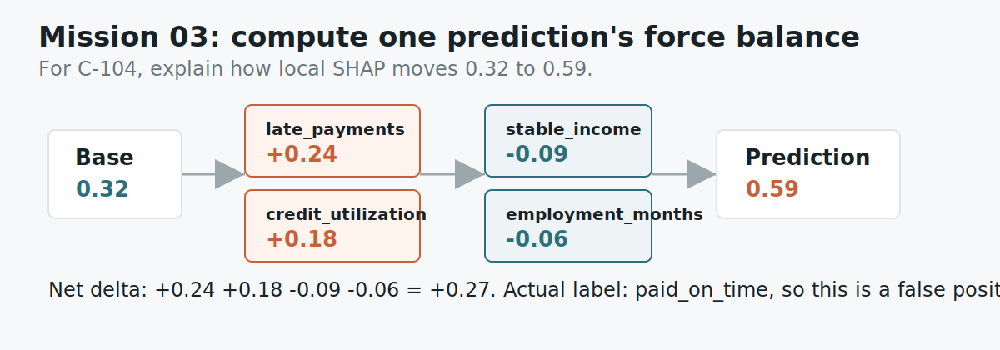

# Mission 03: Compute The Local SHAP Force Balance

## Learning Objective

This mission teaches local explanation. Instead of asking which features matter
on average, you explain one specific prediction.

The case is intentionally interesting: the model predicted risk, but the actual
label says the person paid on time. Your job is not to defend the model. Your
job is to explain why the model behaved that way.

{ .mission-infographic }

<div class="mission-widget" data-mission-widget="mission-03"></div>

## Artifact

```text
labs/artifacts/loan_risk_casebook.json
```

Open:

```text
local_cases -> case_id C-104
```

## Background

For this challenge:

- positive SHAP values push risk up
- negative SHAP values push risk down

Do not just list every field. Say which forces won, and calculate the net
movement from the base probability to the predicted probability.

The phrase "forces won" is useful because local SHAP is a push-and-pull story.
Some features push the score upward. Other features pull it downward. The final
prediction depends on the combined movement.

## Mini Lesson

Local explanations are useful when somebody points at one prediction and asks:

> Why this one?

For case `C-104`, the model predicted late repayment risk, but the actual label
was paid on time. That means the model made a mistake. SHAP does not magically
fix the mistake. It helps us understand the model's reasoning so we can review
where the mistake came from.

Your job is to explain the model's internal push-and-pull:

- Which features made the model more worried?
- Which features made the model less worried?
- Why did the model still end up on the risky side?

This is a practical skill. When a model fails, teams need more than "it was
wrong." They need to know what evidence the model over-weighted or under-weighted.

## Study Note

The most important word in this mission is "local." Local does not mean simple.
It means the explanation belongs to one row, one prediction, and one decision
moment.

Imagine two different applicants. The global summary might say
`late_payments` is usually important across the whole dataset. But one applicant
may have no late payments, while another has several. The local SHAP explanation
for those two applicants can be very different. That is why you should not copy
the global answer into this mission.

For `C-104`, you are reading a small argument inside the model. The risk-up
features are the reasons the model became concerned. The risk-down features are
the reasons it should have been less concerned. The final prediction is what
happened after those forces were combined.

## Guided Reading

Inside case `C-104`, find the `shap_values` list. For each feature, read:

- the feature name
- the SHAP value
- the direction label

Then group the features into two buckets:

| Bucket | Meaning |
|---|---|
| `pushes_risk_up` | Features that made the model more worried |
| `pushes_risk_down` | Features that made the model less worried |

Your explanation should mention both buckets, the strongest feature on each
side, the net movement, and the error type.

## Worked Reading

For `C-104`, you will see entries like:

```json
{
  "feature": "late_payments",
  "value": 2,
  "shap": 0.24,
  "direction": "pushes_risk_up"
}
```

Read that as:

> The applicant had 2 late payments, and this feature pushed the model toward a
> higher risk prediction.

You will also see negative SHAP values:

```json
{
  "feature": "stable_income",
  "value": true,
  "shap": -0.09,
  "direction": "pushes_risk_down"
}
```

Read that as:

> Stable income reduced the risk score, but it did not reduce it enough to
> overcome the upward pressure from the other features.

## Common Mistakes

Do not say the model was correct. The artifact says the actual label was
`paid_on_time`, so this is a wrong prediction.

Do not list only the upward features. A useful local explanation includes both
the evidence for the model's concern and the evidence that pulled the other way.

Do not write only numbers. Numbers are evidence, but the mission asks for an
explanation.

## Scored Questions

A complete answer does five things:

1. Confirms the case being explained.
2. Names the strongest positive SHAP feature.
3. Names the strongest negative SHAP feature.
4. Calculates the net movement from base probability to predicted probability.
5. Classifies the model error using the prediction and actual label.

## Submit

```json
{
  "participant_id": "AIEX-YOUR-TEAM",
  "mission_id": "mission-03",
  "answer": {
    "case_id": "C-104",
    "strongest_positive_feature": "feature name",
    "strongest_negative_feature": "feature name",
    "net_shap_delta": "predicted probability minus base probability",
    "error_type": "what kind of model error happened?"
  },
  "evidence": [
    "Use the base probability, predicted probability, and named SHAP values to explain the force balance."
  ]
}
```

## Self Check

Could a non-ML person understand why the model got nervous?
