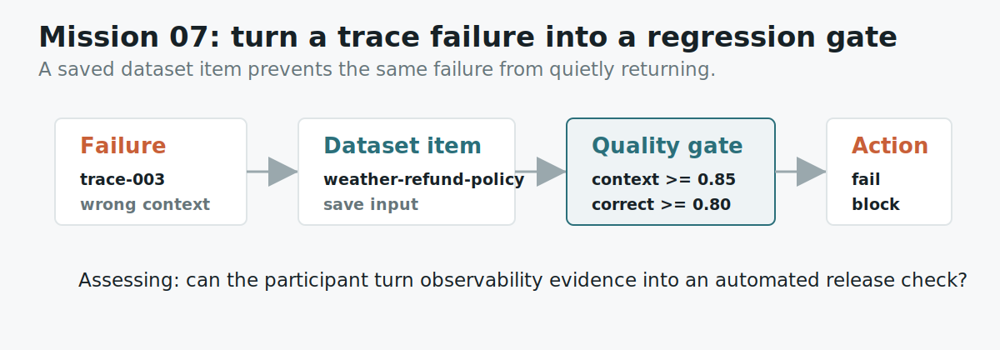

# Mission 07: Design A Regression Evaluation Gate

## Learning Objective

This mission teaches the difference between noticing a failure and preventing a
regression. A trace explains what went wrong once. An evaluation dataset helps
you check whether the same thing goes wrong again.

{ .mission-infographic }

<div class="mission-widget" data-mission-widget="mission-07"></div>

## Artifact

```text
labs/artifacts/support_bot_traces.json
```

Use the failing trace from Mission 06.

## Background

One bad trace is a bug report. A dataset item is how you make sure the bug does
not come back.

In Opik-style workflows, you can keep examples and evaluate future changes
against them.

The workflow is simple:

1. Save the user question.
2. Save the expected behavior.
3. Choose a metric that should improve.
4. Run the same case after each change.

This is how an AI debugging story becomes an engineering feedback loop.

## Mini Lesson

A single trace is a snapshot. A dataset item is a reusable test.

This distinction matters because AI teams often fix a bug once and then break it
again later. Maybe someone changes the prompt. Maybe the retrieval index is
rebuilt. Maybe the team switches model settings. Without a saved evaluation
case, the same failure can return quietly.

An evaluation dataset gives the team a small set of examples that should keep
working. Each item usually includes an input, expected behavior, and one or more
metrics. The team can run the dataset after changes and compare results.

In this mission, the failed typhoon refund question should become a regression
test. If a future version again retrieves venue Wi-Fi context for that question,
the evaluation should catch it.

## Study Note

This is where observability becomes product quality. A trace is excellent for
understanding yesterday's failure. A dataset is how you protect tomorrow's
release.

A useful dataset item is small and specific. It should contain the exact kind of
input that failed, the behavior you expect, and the metric that would reveal the
failure. You do not need a giant benchmark to learn the idea. One saved example
is enough to show the workflow.

The failure in Mission 06 is a perfect candidate because it has a stable user
question and a clear wrong turn. If the app retrieves irrelevant context again,
`context_relevance` should warn you before a user has to report the bug.

## Guided Reading

Look at the failing trace from Mission 06. Find the `dataset_item` field. Then
look at the scores and choose a metric that would catch the same failure next
time.

## Worked Reading

The artifact gives the dataset item name:

```text
weather-refund-policy
```

That name tells you what the saved case should protect. The user asked about
weather and refund policy, so future versions should retrieve event-policy
context and answer that topic.

Two useful metrics are:

| Metric | What it checks |
|---|---|
| `context_relevance` | Did retrieval return useful context? |
| `answer_correctness` | Did the final answer answer the question? |

For this specific failure, `context_relevance` is especially natural because the
first bad step was retrieval.

## Common Mistakes

Do not write a regression rule that only says "make it better." A regression
rule should say what fails, blocks, or alerts when the score drops.

Do not choose a metric unrelated to the failure. If retrieval caused the bug,
context relevance is a strong metric to watch.

Do not forget the dataset item name. This mission is about turning a trace into
a repeatable case.

## Scored Questions

A complete evaluation gate does five things:

1. Names the dataset item that preserves the failure.
2. Saves the user input pattern that triggered the bug.
3. Describes the expected context for a correct retrieval.
4. Sets thresholds for both context relevance and answer correctness.
5. States what the pipeline should do when the gate fails.

## Submit

```json
{
  "participant_id": "AIEX-YOUR-TEAM",
  "mission_id": "mission-07",
  "answer": {
    "dataset_item": "item-name-here",
    "saved_input": "the user question or stable input pattern",
    "expected_context": "what kind of context should be retrieved",
    "quality_gate": "thresholds for the metrics",
    "regression_action": "what should happen if the gate fails?"
  },
  "evidence": [
    "The trace becomes a repeatable test because ..."
  ]
}
```

## Self Check

Could this test catch the same failure next week?
