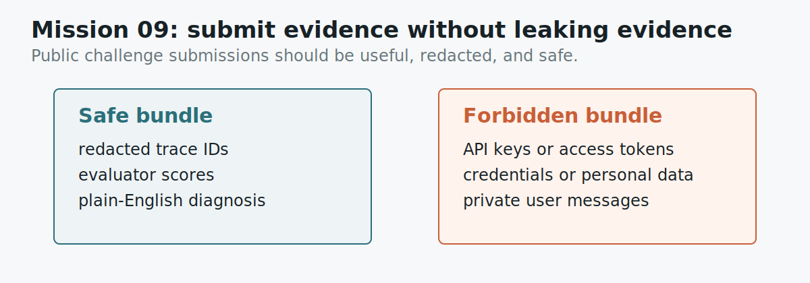

# Mission 09: Build A Safe Public Evidence Bundle

## Learning Objective

This mission teaches safe evidence handling. Observability is powerful because
it gives teams visibility into real requests. That same visibility can expose
private information if people are careless.

{ .mission-infographic }

## Artifact

```text
labs/artifacts/support_bot_traces.json
```

Open:

```text
safe_boundary
```

## Background

Real observability data can contain sensitive information. In this challenge,
you only submit redacted toy evidence.

In a real project, traces may include user messages, retrieved document text,
tool arguments, internal URLs, or metadata. A public workshop repository should
not contain any of that. For this challenge, the safe evidence is already
provided in toy JSON files.

## Mini Lesson

Good observability creates visibility. Bad evidence handling turns visibility
into a privacy problem.

This challenge avoids that problem by using toy artifacts. There are no real
customer traces, no API keys, no private documents, and no production logs. Your
submission should stay inside that boundary.

The habit to learn is simple:

- submit enough evidence for review
- remove anything private or secret
- prefer IDs, scores, and summaries over raw sensitive content

In a real company, teams often redact or aggregate trace information before
sharing it outside the immediate engineering context. The same instinct applies
here, even though the data is fake.

## Study Note

A public challenge has a different evidence boundary from an internal incident
review. Internal reviewers may have permission to inspect detailed logs. Public
repo maintainers, meetup organizers, and GitHub Actions jobs do not need that
level of access.

The safest habit is to submit references and summaries. A trace ID, a metric
name, a score, and a short description are usually enough for this tutorial. Raw
secrets are not stronger evidence. They are just unsafe evidence.

This matters for both SHAP and Opik work. SHAP artifacts can contain sensitive
features. Opik traces can contain user text, retrieved documents, tool inputs,
or model outputs. The tutorial uses toy data so you can learn the workflow
without copying private material into a public repository.

When in doubt, ask whether the reviewer can check your reasoning using only the
challenge files. If yes, the evidence is probably enough. If your proof depends
on private logs, screenshots, tokens, or customer text, it belongs outside the
public submission.

## Guided Reading

Open the `safe_boundary` section. It names what is allowed and what is
forbidden. Your answer should show that you understand both sides:

- what kind of artifact is safe to submit
- what kind of artifact must never be submitted

The evidence sentence should explain why the scoring repo does not need real
secrets.

## Worked Boundary

Safe evidence:

- `trace-003`
- `context_relevance: 0.22`
- "retrieval returned Wi-Fi policy for a refund question"
- a short JSON writeup

Unsafe evidence:

- API keys
- access tokens
- private user messages
- real customer data
- credentials or screenshots containing secrets

The scorer does not need unsafe evidence. It only needs your explanation and the
toy artifact references.

## Common Mistakes

Do not submit real screenshots from private tools.

Do not paste API keys "just as proof." Secrets are never useful proof in this
public challenge.

Do not include personal data from real users. The challenge artifacts are enough.

## Scored Questions

A complete safe-evidence answer does four things:

1. Describes the bundle that is safe to submit.
2. Describes the bundle that must never be submitted.
3. Gives a redaction rule for public repositories.
4. Explains why the toy artifacts are enough for scoring.

## Submit

```json
{
  "participant_id": "AIEX-YOUR-TEAM",
  "mission_id": "mission-09",
  "answer": {
    "safe_bundle": "redacted public evidence bundle",
    "forbidden_bundle": "unsafe evidence bundle",
    "redaction_rule": "rule for public submissions"
  },
  "evidence": [
    "The repo uses toy public artifacts, so explain why secrets are unnecessary."
  ]
}
```

## Self Check

Would you be comfortable with your submitted evidence appearing on a public
projector during the meetup?
