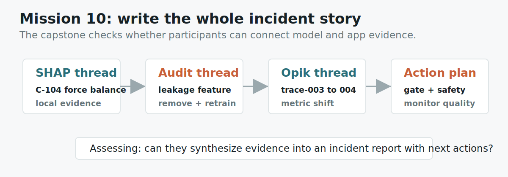

# Mission 10: Capstone Evidence Synthesis

## Learning Objective

This capstone checks whether you can combine the whole tutorial without mixing
up the tools. Earlier missions let you answer one focused question at a time.
This mission asks you to stitch several pieces of evidence into one incident
analysis.

By the end, you should be able to explain:

- what SHAP says about one wrong loan-risk prediction
- what the feature audit says about data leakage
- what the Opik-style traces say about one failed support-bot request
- what changed between the failed trace and the fixed trace
- what evidence is safe to submit in a public repository
- what concrete engineering actions should happen next

This is intentionally harder than the earlier missions. A short answer with
"SHAP explains features and Opik explains traces" is no longer enough.

{ .mission-infographic }

<div class="mission-widget" data-mission-widget="mission-10"></div>

## Artifacts

```text
labs/artifacts/loan_risk_casebook.json
labs/artifacts/support_bot_traces.json
```

## Background

The two tools answer different debugging questions:

- SHAP asks: which features moved a model prediction?
- Opik asks: which step in an AI application request produced the bad behavior?

The capstone asks you to use both answers in one report. That does not mean the
two tools are doing the same job. It means a real incident often has more than
one kind of evidence.

In this challenge, the model-side evidence is in `loan_risk_casebook.json`. The
important local case is `C-104`. The model predicted late repayment risk, but
the actual label says the applicant paid on time. SHAP shows which features
pushed the prediction up and which features pushed it down. The same artifact
also contains a known trap: `post_approval_call_count`, a data-leakage feature
that is only known after the loan decision.

The application-side evidence is in `support_bot_traces.json`. The important
failed trace is `trace-003`, where the user asked about typhoon refunds but the
retrieval step returned venue Wi-Fi context. The fixed trace is `trace-004`,
where retrieval uses event-policy context instead. The comparison is supported
by the `context_relevance` score moving from `0.22` to `0.91`.

## Why This Is Harder

This mission is not a scavenger hunt for one field name. It is a synthesis
task. You must keep several ideas separate and then connect them carefully:

| Evidence type | What you must do |
|---|---|
| Local SHAP | Explain the push-up and push-down features for `C-104` |
| Leakage audit | Identify the feature that should not be available at decision time |
| Opik trace | Find the failing request path and the broken component |
| Before/after comparison | Compare `trace-003` with `trace-004` using a metric |
| Evaluation plan | Convert the failure into a regression dataset item |
| Safety boundary | Submit only redacted toy evidence, never secrets |

The trap is writing one vague paragraph that sounds confident but does not name
the evidence. A good capstone names the exact case, feature, trace, metric, and
dataset item.

## Mini Lesson

A useful incident report is a chain of claims. Each claim needs evidence.

For the SHAP side, the claim is not simply "the model was wrong." The stronger
claim is:

> In case `C-104`, the model predicted late repayment risk even though the
> actual label was paid on time. `late_payments` and `credit_utilization` pushed
> risk upward, while `stable_income` and `employment_months` pushed risk
> downward.

That sentence is useful because it explains the model's internal reasoning. It
does not say the model was morally right. It says why the model moved in the
direction it did.

For the leakage side, the claim is not simply "there was a suspicious feature."
The stronger claim is:

> `post_approval_call_count` is a data-leakage feature because it is only known
> after the approval decision.

That sentence is useful because it explains why the feature should be removed
or audited before retraining.

For the Opik side, the claim is not simply "the bot was bad." The stronger claim
is:

> `trace-003` failed at retrieval because the user asked about typhoon refunds,
> but the app retrieved venue Wi-Fi context. In `trace-004`, retrieval used
> event-policy context and `context_relevance` improved from `0.22` to `0.91`.

That sentence is useful because it identifies the broken component and shows the
before-and-after evidence.

## Required Structure

Your JSON answer must be more detailed than the earlier missions. Use these
fields:

| Field | What it should contain |
|---|---|
| `incident_type` | The application incident category, such as retrieval context mismatch |
| `shap_case_id` | The local SHAP case you are using |
| `shap_risk_up_features` | Features that pushed `C-104` toward risk |
| `shap_risk_down_features` | Features that pushed `C-104` away from risk |
| `leakage_feature` | The feature that should not be available at decision time |
| `failing_trace_id` | The bad Opik-style trace |
| `fixed_trace_id` | The after-fix trace |
| `failed_component` | The step that first went wrong |
| `metric_shift` | The score movement that proves improvement |
| `regression_dataset_item` | The dataset item that should protect against regression |
| `safe_evidence_boundary` | A sentence about redacted evidence and no secrets |
| `next_action` | A concrete engineering action plan |

The `evidence` field should be a short incident report of at least one solid
paragraph. It should mention `C-104`, `trace-003`, `trace-004`, and
`post_approval_call_count`.

## Worked Planning Table

Before writing JSON, fill this table for yourself:

| Question | Evidence |
|---|---|
| Which model case was wrong? | `C-104` |
| Which features pushed risk up? | `late_payments`, `credit_utilization` |
| Which features pushed risk down? | `stable_income`, `employment_months` |
| Which feature is a leakage trap? | `post_approval_call_count` |
| Which trace failed? | `trace-003` |
| Which trace shows the fix? | `trace-004` |
| Which component failed first? | `retrieval` |
| Which metric moved? | `context_relevance: 0.22 -> 0.91` |
| Which dataset item should be saved? | `weather-refund-policy` |
| What evidence is safe? | redacted trace IDs, scores, and plain-English diagnosis |

The table is not the final answer. It is the evidence map. The final answer
should turn the map into a readable incident report.

## Common Mistakes

Do not submit a generic summary of the whole tutorial. This is a capstone, not a
book report.

Do not say "SHAP found the bad retrieval." SHAP does not inspect the support-bot
request path. SHAP explains model feature contributions.

Do not say "Opik found the leaking feature." Opik traces the LLM application
request. The leakage trap is in the loan-risk artifact.

Do not mention `trace-003` without `trace-004`. The capstone asks for diagnosis
and improvement, so the before-and-after comparison matters.

Do not write an action like "make the AI better." A concrete action says what to
remove, retrain, test, monitor, or evaluate.

Do not submit secrets, private user messages, production screenshots, or access
tokens. The public repo only needs the toy artifact IDs, scores, and your
explanation.

## What A Good Answer Looks Like

A good answer reads like a small incident report from someone who actually
opened both artifact files. It names the wrong prediction, names the SHAP
forces, flags the leakage feature, diagnoses the failed trace, compares the
fixed trace, cites the metric movement, keeps evidence safe, and recommends
specific next actions.

The answer should be compact, but not shallow. Imagine handing it to a teammate.
They should know exactly which artifact lines to inspect and what engineering
work to do next.

## Submit

```json
{
  "participant_id": "AIEX-YOUR-TEAM",
  "mission_id": "mission-10",
  "answer": {
    "incident_type": "retrieval context mismatch",
    "shap_case_id": "C-104",
    "shap_risk_up_features": ["feature_a", "feature_b"],
    "shap_risk_down_features": ["feature_c", "feature_d"],
    "leakage_feature": "feature_name_here",
    "failing_trace_id": "trace-id-here",
    "fixed_trace_id": "trace-id-here",
    "failed_component": "component-name-here",
    "metric_shift": "metric-name moved from old-value to new-value",
    "regression_dataset_item": "dataset-item-name-here",
    "safe_evidence_boundary": "what is safe to submit and what must stay out",
    "next_action": "specific remove, retrain, test, monitor, or evaluate plan"
  },
  "evidence": [
    "Write a complete incident report paragraph. Mention C-104, trace-003, trace-004, post_approval_call_count, the SHAP force direction, the retrieval failure, the score movement, and the safe evidence boundary."
  ]
}
```

## Self Check

Could another team reproduce your reasoning from the artifacts alone, and could
an engineer turn your next action into work without asking what you meant?
